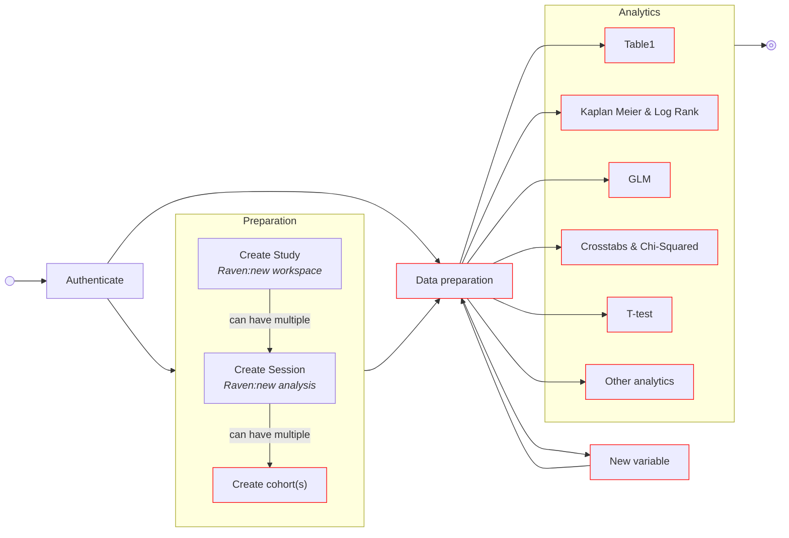
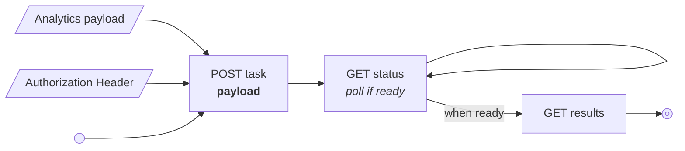
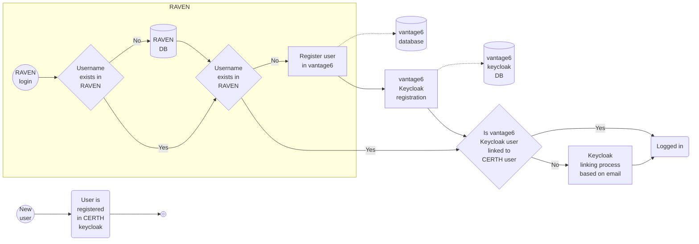

# IDEA4RC Deliverables

This folder contains all documentation required for the vantage6 components to be integrated into the IDEA4RC ecosystem.

**Contents**
- [Workflow](#workflow)
- [Task creation](#task-creation)
- [Data types](#data-types)
- [Authentication](#authentication)
- [Algorithms](#algorithms)
  - [Summary](#summary)
  - [Crosstabs & Chi-Square (Contingency table)](#crosstabs--chi-square-contingency-table)
  - [T-test](#t-test)
  - [Kaplan Meier and Log Rank](#kaplan-meier-and-log-rank)

**Folder structure**

```bash
deliverables/
├── algorithm-tests/ # Local testing of the algorithms used by IKNL team
│   ├── data/ # local test data
│   │   ├── ETL_from_omop.ipynb
│   │   ├── pelvis_cohort.parquet
│   │   ├── rps_cohort.parquet
│   │   └── rps_pelvis_cohort.parquet
│   ├── crosstabs-and-chisq.ipynb
│   ├── glm.ipynb
│   ├── kaplan-meier.ipynb
│   ├── summary.ipynb
│   └── t-test.ipynb
├── raven-api-documentation/ # Documentation for integrating vantage6 into RAVEN
│   ├── 0-new-workspace.ipynb
│   ├── 1-new-analysis.ipynb
│   ├── 2-new-cohort.ipynb
│   ├── 3-data-preparation.ipynb
│   ├── 4-analytics-crosstabs-and-chisquared.ipynb
│   ├── 6-analytics-t-test.ipynb
│   ├── 7-analytics-kaplan-meier-and-log-rank.ipynb
│   ├── 8-analytics.ipynb
│   └── token.txt # used for authentication in the 0-X notebooks
├── security-and-privacy/ # Security analysis per algorithm required by the CoEs
│   ├── Security & Privacy Crosstab.pdf
│   ├── Security & Privacy GLM.pdf
│   ├── Security & Privacy Kaplan-Meier.pdf
│   └── Security & Privacy t-test.pdf
└── README.md
```


This folder contains the deliverables required for the integration with the RAVEN UI.
Each algorithm has its own folder, containing the following files:

- Security an Privacy document
- API documentation for the lifecycle of the algorithm
- Visualization documentation for the analytics


## Workflow
The workflow from a vantage6 point of view is as follows:



## Task creation 
In the flow described above all the `Create cohorts`, `Data preperation`, `Analysis` and `New variable` require a vantage6 task. To create these a single vantage6 endpoint is used in which the payload of the POST request differs for each tasks. The exact payload is given in the notebooks, for example the [data preparation](raven-api-documentation/3-data-preparation.ipynb). The flow is however always the same:




## Data types 
Vantage6 loads the data from the OMOP database. When it does so, it assigns specific numpy/pandas types to all extracted variables. This helps us: 

* In the user interface when the user is asked to select variables of a certain type. For example in Kaplan Meier analysis the user needs to select the survival time variable which requires to be a positive int. 
* In the algorithm when we need to convert one type in another. For example when we need a boolean to be represented as a `0` and `1` instead of `false` and `true`.

We accept the following (numpy) types:

* [numeric (numpy)](https://numpy.org/doc/stable/reference/arrays.scalars.html#numpy.number)
* [bool (numpy)](https://numpy.org/doc/stable/reference/arrays.scalars.html#numpy.bool_)
* [datetime64[ns, tz] (numpy)](https://numpy.org/doc/stable/reference/arrays.scalars.html#numpy.datetime64)
* [CategoricalDtype (pandas)](https://pandas.pydata.org/docs/reference/api/pandas.CategoricalDtype.html#pandas.CategoricalDtype)


## Authentication
Vantage6 uses its own Keycloak instance which is linked to the CERTH keycloak instance. Authentication process will be as follows (handled by RAVEN and the keycloak instances):



## Algorithms 

### Summary
The summary algorithm computes a lot of descriptive statistics. I suggest to have a
brief look at the swimlane diagram in the [Security and Privacy documentation](./security-and-privacy/summary.pdf).

>[!NOTE]
> This algorithm is both used to compute the statistics for the data preparation step and to compute the table1 output.

The input parameters are as follows:

|Argument|Required|Type|Description|
|---|---|--|---|
|`columns`|No|`list[str]`| List of variable names to compute the summary for. If omnitted, what should be the case in IDEA4RC, all variables available in the dataframe are analysed.
|`numeric_colums`|No|`list[str]`| List of variables that are numerical, should be a subset of the `columns` and the column type should be numerical. If omnitted, what should be the case in IDEA4RC, types are inferred.|
|`organizations_to_include` |No| `list[int]` | List of vantage6 organization IDs that need to be included in the analysis|
|`stratification_column`|No|`str`| Name of the variable that the results should be stratified to. In case of the data preperation this should be omnitted. In case of the table1 analysis this should be an optional parameter that the user can specify. **The stratification variable should be of type `categorical`**.|

### Crosstabs & Chi-Square (Contingency table)
The crosstabs algorithm computes the contingency table of two or more categorical
variables. I suggest to have a brief look at the swimlane diagram in the [Security and Privacy documentation](./security-and-privacy/Security%20&%20Privacy%20Crosstab.pdf).

The input parameters are as follows:

|Argument|Required|Type|Description|
|---|---|--|---|
|`results_col`| Yes | `str` | The variable for which counts are calculated. **The variable should be of type `categorical`**.
| `groups_col` | Yes | `list[str]` | List of variables to group the data by. **Each of the variables in the list should be of type `categorical`**
| `organizations_to_include` |No| `list[int]` | List of vantage6 organization IDs that need to be included in the analysis|
| `include_chi2` | No | `bool` | Do not supply as this is by default `True` | 
| `include_totals` | No | `bool` | Do no supply as this is by default `True` | 

### T-test
The T test algorithm computes a t-test for two (or more) samples. I suggest to have a brief look at the swimlane diagram in the [Security and Privacy documentation](./security-and-privacy/Security%20&%20Privacy%20t-test.pdf) to have a good overview of the different steps in the algorithm.

The t-test will automatically use all available variables of the type *numeric*, therefore there is no option to specify which variables to compute it for. This implementation computes the t-test of all numeric variables between **2 organizations*. If needed we can extend this to the case that the user selects a single reference organization to which we compute all t-test compared to that single organization.

The input parameters are as follows:

|Argument|Required|Type|Description|
|---|---|--|---|
| `organizations_to_include` |No| `list[int]` | List of vantage6 organization IDs that need to be included in the analysis. **In the case of the t-test we need this to be exactly two organizations!** |

### Kaplan Meier and Log Rank
The Kaplan Meier algorithm computes a Kaplan Meier estimate for the survival function. I suggest to have a brief look at the swimlane diagram in the [Security and Privacy documentation](./security-and-privacy/Security%20&%20Privacy%20Kaplan-Meier.pdf) to have a good overview of the different steps in the algorithm.

|Argument|Required|Type|Description|
|---|---|--|---|
|`time_column_name`|Yes|`str`| The variable name which contains the (survival) time. **This variable needs to be of type `numeric`**.
|`censor_column_name`|Yes|`str`|The variable name which contains the (survival) time. **This variable needs to be of type `bool`**.
|`organizations_to_include`|No|`list[int]`|List of vantage6 organization IDs that need to be included in the analysis.|
|`strata_column_name`|No|`str`| The variable name to which you want to stratify. **This variable needs to be of the type `categorical`**|