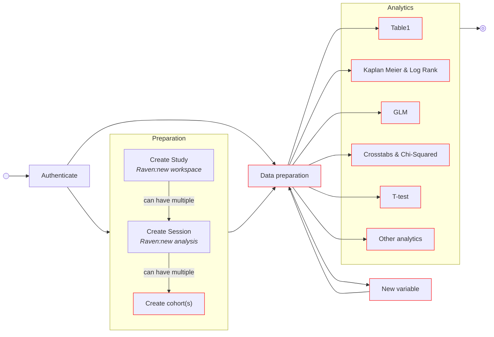
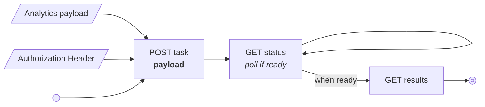
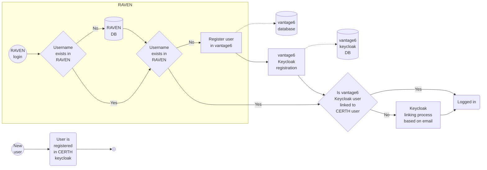

# IDEA4RC Deliverables

This folder contains all documentation required for the vantage6 components to be integrated into the IDEA4RC ecosystem.

**Contents**
- [Introduction](#introduction)
- [User workflow](#user-workflow)
- [Task creation](#task-creation)
- [Data types](#data-types)
- [Authentication](#authentication)
- [Analytics Algorithms](#analytics-algorithms)
  - [Summary & Table1](#summary-and-table1)
  - [Crosstabs & Chi-Square (Contingency table)](#crosstabs--chi-square-contingency-table)
  - [T-test](#t-test)
  - [Kaplan Meier and Log Rank](#kaplan-meier-and-log-rank)
  - [GLM](#glm)
- [Preprocessing Algorithms](#preprocessing-algorithms)
  - [Timedelta](#timedelta)

## Introduction
This folder collects all documentation and files required to support the integration and validation of vantage6 components in the IDEA4RC project. Here you will find materials and guides for algorithm testing, integrating with the RAVEN UI, security and privacy reviews, and deployment configuration for orchestrator and capsule environments. Use this folder as the starting point for understanding how vantage6 fits within the IDEA4RC infrastructure and to access all technical resources necessary for local and federated analytics development, testing, and deployment.

**Folder structure**

```bash
deliverables/
├── algorithm-tests/ # Local testing of the algorithms used by IKNL team
│   ├── data/ # local test data
│   │   ├── ETL_from_omop.ipynb
│   │   ├── pelvis_cohort.parquet
│   │   ├── rps_cohort.parquet
│   │   └── rps_pelvis_cohort.parquet
│   ├── crosstabs-and-chisq.ipynb
│   ├── glm.ipynb
│   ├── kaplan-meier.ipynb
│   ├── preprocessing_timedelta.ipynb
│   ├── summary.ipynb
│   └── t-test.ipynb
├── raven-api-documentation/ # Documentation for integrating vantage6 into RAVEN
│   ├── 0-new-workspace.ipynb
│   ├── 1-new-analysis.ipynb
│   ├── 2-new-cohort.ipynb
│   ├── 3-data-preparation.ipynb
│   ├── 4-analytics-crosstabs-and-chisquared.ipynb
│   ├── 6-analytics-t-test.ipynb
│   ├── 7-analytics-kaplan-meier-and-log-rank.ipynb
│   ├── 8-analytics-glm.ipynb
│   ├── 9-preprocessing-time-delta.ipynb
│   └── token.txt # used for authentication in the 0-X notebooks, not in the repo. Create yourself.
├── security-and-privacy/ # Security analysis per algorithm required by the CoEs
│   ├── Security & Privacy Summary.pdf      
│   ├── Security & Privacy Crosstab.pdf     
│   ├── Security & Privacy GLM.pdf
│   ├── Security & Privacy Kaplan-Meier.pdf
│   └── Security & Privacy t-test.pdf
├── vantage6-configuration/ # Configurations of the deployment
│   └── orchestrator-deployment/ # Helm files used for the deployment at the orchestrator
│       ├── keycloak-values.yaml     # Example Helm values for server deployment
│       ├── server-values.yaml       # Example Helm values for server deployment
│       └── store-values.yaml        # Example Helm values for capsule deployment
└── README.md
```

## Vantage6 Architecture for IDEA4RC
Several changes have been made in the vantage6 infrastucture at core level to support the IDEA4RC usecases:

- The vantage6 node no longer uses the `docker.sock` but connect to the Kubernetes API. This change does not change anything from the users perpective but has great impact on the deployment. In IDEA4RC the capsules architecture is based on Kubernetes which did not support exposing the `docker.sock` to the containers. To see all the changes that have been made, see [this](https://github.com/vantage6/vantage6/issues/248) issue. The same process has been performed for the orchestrator components. The Helm configuration files that have been used in the UPM orchestrator and in the capsules can be found in the [/vantage6-configuration](./vantage6-configuration/orchestrator-deployment/) folder.
- The data extraction job is seperated from the analytics. This had multiple advantages: 
    - Extracting data from an OMOP source, especially when complex querries are needed, is expensive. Doing this for every algorithm and for every step in the algorithm is a waste of time. This was especially important for iterative algorithms like the GLM and CoxPH. 
    - If you have a tabular data frame (the result of the data extraction job) before you do your analytics you can profide the user with more guidance as you have the variables (column names), their types and possibly some other metadata.
    - Algorithms are no longer specific to a specific database type as all analytics expect a tabular data frame which has been profided by the data extraction job
  
  


## User Workflow
The workflow from a vantage6 point of view is as follows:



The connection to RAVEN and the database is as follows:

* For a new workspace (RAVEN) we create a new study in vantage6.
* For a new analysis (RAVEN) we create a new session in vantage6.
* For a new cohort (RAVEN) we create a new dataframe in the vantage6 session.

So each session can contain multiple dataframes (cohorts). Each cohort is either a sarcoma or head and neck cohort. This determines which variables are extracted from the database. All cohorts in each (RAVEN) analysis have in this instance the same variables. This is important because vantage6 algorithms can run on multiple cohorts at the same time. This obviously works only when these cohorts have the same data available. See the section on [data extraction](#data-extraction) for more details on the extraction process.

Users in RAVEN are also allowed to create new variables. Since we need to keep the dataframes (cohorts) in sync in terms of variables (columns) we need to apply every preprocessing step to all dataframes so to keep the data aligned.

>[!NOTE]
> In case a preprocessing step fails, vantage6 wont allow any analytics to be run because it can not verify that all nodes have the same data at that point. A dataframe in vantage6 is a *federated* dataframe, thus modifying a single dataframe in practice means that we need to visit all data stations to apply it. In case one of the centers fails, the dataframe becomes out of sync between the centers. To avoid that vantage6 blocks the dataframe, all preprocessing steps will pass (using `try-except` style catching). However that will put pressure on us to write preprocessing algorithms that never fail.

In order to limit the possibilites of preprocessing and analytics we only allow certain data types, see [data-types](#data-types). This makes the environment way more controlled.


## Task creation 
In the flow described above all the `Create cohorts`, `Data preperation`, `Analysis` and `New variable` require a vantage6 task. To create these a single vantage6 endpoint is used in which the payload of the POST request differs for each tasks. The exact payload is given in the notebooks, for example the [data preparation](raven-api-documentation/3-data-preparation.ipynb). The flow is however always the same:




## Data types 
Vantage6 loads the data from the OMOP database. When it does so, it assigns specific numpy/pandas types to all extracted variables. This helps us: 

* In the user interface when the user is asked to select variables of a certain type. For example in Kaplan Meier analysis the user needs to select the survival time variable which requires to be a positive int. 
* In the algorithm when we need to convert one type in another. For example when we need a boolean to be represented as a `0` and `1` instead of `false` and `true`.

We accept the following (numpy) types:

* [numeric (numpy)](https://numpy.org/doc/stable/reference/arrays.scalars.html#numpy.number)
* [bool (numpy)](https://numpy.org/doc/stable/reference/arrays.scalars.html#numpy.bool_)
* [datetime64[ns, tz] (numpy)](https://numpy.org/doc/stable/reference/arrays.scalars.html#numpy.datetime64)
* [CategoricalDtype (pandas)](https://pandas.pydata.org/docs/reference/api/pandas.CategoricalDtype.html#pandas.CategoricalDtype)


## Data Extraction
TODO

* Head and Neck querry
* Sarcoma Query
* Types conversion

## Authentication
Vantage6 uses its own Keycloak instance which is linked to the CERTH keycloak instance. Authentication process will be as follows (handled by RAVEN and the keycloak instances):



## Preprocessing Algorithms

> [!IMPORTANT]
> It is important that every preprocessing algorithm is applied to all dataframes in the same session.

### Timedelta
Compute the number it days between a `datetime` column and a reference date. The output of the function is an Int.

The input parameters are as follows:

|Argument|Required|Display as argument|Type|Description|
|---|---|---|---|---|
|`column`|Yes|Yes|`str`|The column name that contains the start date. This should be of type `datetime64`.
|`output_column`|Yes|Yes|`str`|The new variable column name.
|`to_date_column`|No|Yes|`str`|The column containin the end date. If not provided the `to_date` argument will be used.
|`to_date`|No|Yes|`str`|The reference date to use `yyyy-mm-dd`. If not supplied, today will be used.

### Merge categories
Merging/grouping categories. E.g. a column has levels (=categories) `A`, `B` and `C`, but I want to group `B` and `C` into a new category `D` so that I get a new column with only categories `A` and `D`.

The input parameters are as follows:

|Argument|Required|Display as argument|Type|Description|
|---|---|---|---|---|
|`column`|Yes|Yes|`str`|The column name to merge categories from. This should be of type `str` or `category`.|
|`output_column`|Yes|Yes|`str`|The new variable column name which will contain the merged categories.|
|`mapping`|Yes|Yes|`dict[str, list[str]]`|A dictionary specifying how to group the levels. **Keys** are the new merged category names; **values** are lists of the original category names to merge into each new category.|

> **Example:**  
> Suppose you have a column `color` with possible values: `red`, `blue`, `green`, `yellow`. You want to group `blue` and `green` as `cool`, and keep `red` and `yellow` as their own categories.  
> Use:  
> `mapping = {"cool": ["blue", "green"]}`  
> This will create a new column where `blue` and `green` are replaced by `cool`, and `red` and `yellow` remain unchanged.


## Analytics Algorithms 

### Summary and Table1
The summary algorithm computes a lot of descriptive statistics. I suggest to have a
brief look at the swimlane diagram in the [Security and Privacy documentation](./security-and-privacy/summary.pdf).

>[!NOTE]
> This algorithm is both used to compute the statistics for the data preparation step and to compute the table1 output.

The input parameters are as follows:

|Argument|Required|Display as argument|Type|Description|
|---|---|---|---|---|
|`columns`|No|No|`list[str]`| List of variable names to compute the summary for. If omnitted, what should be the case in IDEA4RC, all variables available in the dataframe are analysed.
|`numeric_colums`|No|No|`list[str]`| List of variables that are numerical, should be a subset of the `columns` and the column type should be numerical. If omnitted, what should be the case in IDEA4RC, types are inferred.|
|`organizations_to_include` |No|No| `list[int]` | List of vantage6 organization IDs that need to be included in the analysis|
|`stratification_column`|No|Yes|`str`| Name of the variable that the results should be stratified to. In case of the data preperation this should be omnitted. In case of the table1 analysis this should be an optional parameter that the user can specify. **The stratification variable should be of type `categorical`**.|

### Crosstabs & Chi-Square (Contingency table)
The crosstabs algorithm computes the contingency table of two or more categorical
variables. I suggest to have a brief look at the swimlane diagram in the [Security and Privacy documentation](./security-and-privacy/Security%20&%20Privacy%20Crosstab.pdf).

The input parameters are as follows:

|Argument|Required|Display as argument|Type|Description|
|---|---|---|---|---|
|`results_col`| Yes |Yes| `str` | The variable for which counts are calculated. **The variable should be of type `categorical`**.
| `groups_col` | Yes |Yes| `list[str]` | List of variables to group the data by. **Each of the variables in the list should be of type `categorical`**
| `organizations_to_include` |No|No| `list[int]` | List of vantage6 organization IDs that need to be included in the analysis|
| `include_chi2` | No |No| `bool` | Do not supply as this is by default `True` | 
| `include_totals` | No |No| `bool` | Do no supply as this is by default `True` | 

### T-test
The T test algorithm computes a t-test for two (or more) samples. I suggest to have a brief look at the swimlane diagram in the [Security and Privacy documentation](./security-and-privacy/Security%20&%20Privacy%20t-test.pdf) to have a good overview of the different steps in the algorithm.

The t-test will automatically use all available variables of the type *numeric*, therefore there is no option to specify which variables to compute it for. This implementation computes the t-test of all numeric variables between **2 organizations*. If needed we can extend this to the case that the user selects a single reference organization to which we compute all t-test compared to that single organization.

The input parameters are as follows:

|Argument|Required|Display as argument|Type|Description|
|---|---|---|---|---|
| `organizations_to_include` |No|Yes(!)| `list[int]` | List of vantage6 organization IDs that need to be included in the analysis. **In the case of the t-test we need this to be exactly two organizations!** |

### Kaplan Meier and Log Rank
The Kaplan Meier algorithm computes a Kaplan Meier estimate for the survival function. I suggest to have a brief look at the swimlane diagram in the [Security and Privacy documentation](./security-and-privacy/Security%20&%20Privacy%20Kaplan-Meier.pdf) to have a good overview of the different steps in the algorithm.

|Argument|Required|Display as argument|Type|Description|
|---|---|---|---|---|
|`time_column_name`|Yes|Yes|`str`| The variable name which contains the (survival) time. **This variable needs to be of type `numeric`**.
|`censor_column_name`|Yes|Yes|`str`|The variable name which contains the (survival) time. **This variable needs to be of type `bool`**.
|`organizations_to_include`|No|No|`list[int]`|List of vantage6 organization IDs that need to be included in the analysis.|
|`strata_column_name`|No|Yes|`str`| The variable name to which you want to stratify. **This variable needs to be of the type `categorical`**|

### GLM 
A GLM (Generalized Linear Model) lets you model relationships between variables using linear predictors and flexible distributions, enabling regression and classification tasks. I suugest to have a brief look at the swimlane diagram in the [Security and Privacy documentation](./security-and-privacy/Security%20&%20Privacy%20GLM.pdf) to have a goof overview of the different steps in the algorithm.

|Argument|Required|Display as argument|Type|Description|
|---|---|---|---|---|
|`family`|Yes|Yes|`str`|The exponential family to use for computing the GLM. The available families are `Gaussian`, `Poisson`, `Binomial`, and `Survival`. Depening on which family you select the type of the `outcome_variable` should be different, see the table bellow|
|`outcome_variable`|Yes|Yes|`str`| The variable name of the outcome variable. Not that the type of this variable is dependent on the `family` argument. To see this relationship see the table bellow.|
|`predictor_variables`|Yes|Yes|`list[str]`| The variable names of the predictor variables. The only type that is not allowed here is `datetime[ns, tz]`. `numeric`, `bool` and `category` are accepted.|
|`formula`|No|No|`str`|A text based formula for extra flexibility, I recommend hiding this at least for now|
|`categorical_predictors`|No|No|`list[str]`|The column names of the predictor variables that are categorical. In IDEA4RC we do not supply this as the types are clearly defined in the local datasets, so the algorithm can infer them.
|`category_reference_values`|No|Yes|`dict[str, str]`|A dictonairy that contains variable names as keys and the reference value as the value. *For now we do not know which levels each category has, thus the values need to be able to specify as a free text field*. The variable names that are supplied as keys, need to be of type `category`.|
|`survival_sensor_column`|No*|No*|`str`|The variable name of the survival censor. *Required if the `family` is set to `Survival`. The type of the variable should be `bool`.
|`tolerance_level`|No|No|`numeric`|Do not supply as the default value should be used for now|
|`max_iterations`|No|No|`numeric`|Do not supply as the default value should be used for now|
| `organizations_to_include` |No|No| `list[int]` | List of vantage6 organization IDs that need to be included in the analysis|