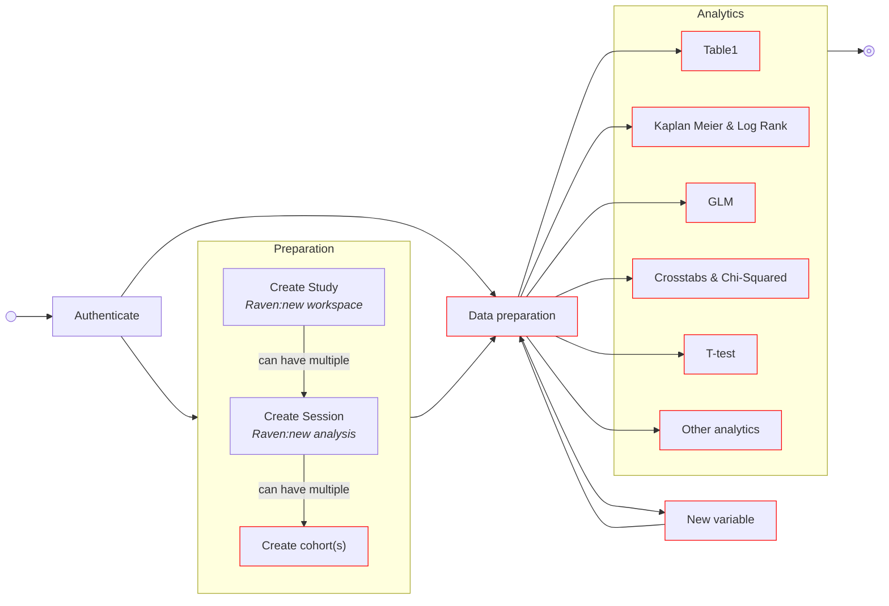
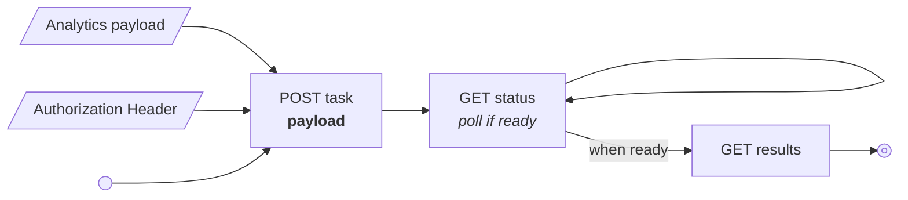
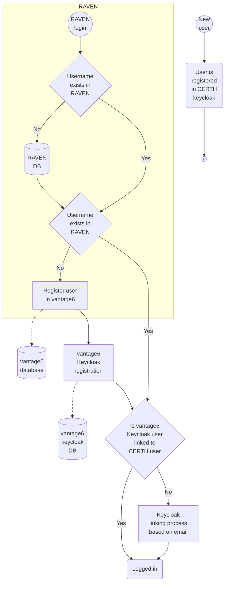

# IDEA4RC Deliverables

This folder contains the deliverables required for the integration with the RAVEN UI.
Each algorithm has its own folder, containing the following files:

- Security an Privacy document
- API documentation for the lifecycle of the algorithm
- Visualization documentation for the analytics

## Workflow
The workflow from a vantage6 point of view is as follows:

## Task creation 
In the flow described above all the `Create cohorts`, `Data preperation`, `Analysis` and `New variable` require a vantage6 task. To create these a single vantage6 endpoint is used in which the payload of the POST request differs for each tasks. The exact payload is given in the notebooks, for example the [data preparation](raven-api-documentation/3-data-preparation.ipynb). The flow is however always the same:

## Data types 
Vantage6 loads the data from the OMOP database. When it does so, it assigns specific numpy/pandas types to all extracted variables. This helps us: 

* In the user interface when the user is asked to select variables of a certain type. For example in Kaplan Meier analysis the user needs to select the survival time variable which requires to be a positive int. 
* In the algorithm when we need to convert one type in another. For example when we need a boolean to be represented as a `0` and `1` instead of `false` and `true`.

We accept the following (numpy) types:

* [numeric (numpy)](https://numpy.org/doc/stable/reference/arrays.scalars.html#numpy.number)
* [bool (numpy)](https://numpy.org/doc/stable/reference/arrays.scalars.html#numpy.bool_)
* [datetime64[ns, tz] (numpy)](https://numpy.org/doc/stable/reference/arrays.scalars.html#numpy.datetime64)
* [CategoricalDtype (pandas)](https://pandas.pydata.org/docs/reference/api/pandas.CategoricalDtype.html#pandas.CategoricalDtype)

## Authentication
Vantage6 uses its own Keycloak instance which is linked to the CERTH keycloak instance. Authentication process will be as follows (handled by RAVEN and the keycloak instances):

